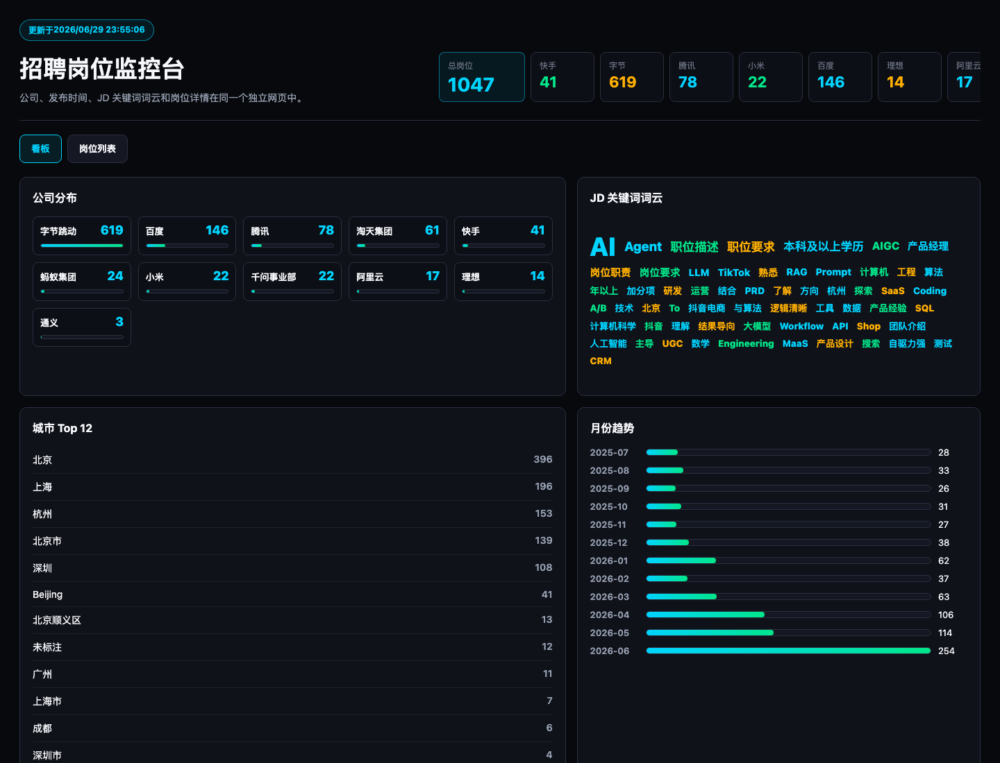
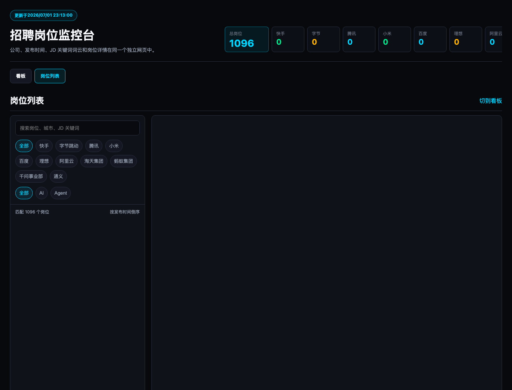

# 国内互联网大厂 AI 岗位监控 Skill

为了方便及时跟进和了解市场上 AI 或 Agent 相关的产品经理岗位，我编写了这样一个 skill：

1. 能够从各家招聘网站中，根据相关关键词找到对应的岗位 JD
2. 能够以网页看板的形式，将所有岗位统一展示出来

目前该 skill 已支持 11 个公司。

当前抓取口径：分别用两个单关键词 `AI`、`Agent` 抓取招聘官网结果，并过滤岗位标题包含“产品经理”的岗位；不使用组合词 `AI Agent`，也不使用 `大模型`、`AIGC`、`智能体`、`人工智能` 等额外搜索词。

## 项目文件

- `ai_agent_pm_jobs.html`：静态岗位看板页面，可直接用浏览器打开，也可通过 GitHub Pages 访问。
- `data/`：岗位 CSV、Markdown 明细和岗位变动记录。
- `.codex/skills/ai-agent-pm-job-radar/SKILL.md`：Codex Skill 使用说明，记录各招聘站抓取技巧、重试策略和页面更新规则。

## 页面截图

### 看板视图

### 岗位列表

## 当前已支持公司

| 公司名 | 岗位数量 | 本次更新 | 更新时间 |
|---|---:|---:|---|
| [快手](https://github.com/FireBEAR12138/ai-agent-pm-job-radar/blob/main/data/kuaishou_ai_agent_pm_jobs.csv) | 24 | +0 -0 | 2026/07/03 22:39:07 |
| [字节跳动](https://github.com/FireBEAR12138/ai-agent-pm-job-radar/blob/main/data/bytedance_ai_agent_pm_jobs.csv) | 29 | +11 -0 | 2026/07/03 22:39:07 |
| [腾讯](https://github.com/FireBEAR12138/ai-agent-pm-job-radar/blob/main/data/tencent_ai_agent_pm_jobs.csv) | 58 | +0 -13 | 2026/07/03 22:39:07 |
| [小米](https://github.com/FireBEAR12138/ai-agent-pm-job-radar/blob/main/data/xiaomi_ai_agent_pm_jobs.csv) | 15 | +0 -0 | 2026/07/03 22:39:07 |
| [百度](https://github.com/FireBEAR12138/ai-agent-pm-job-radar/blob/main/data/baidu_ai_agent_pm_jobs.csv) | 137 | +0 -3 | 2026/07/03 22:39:07 |
| [理想](https://github.com/FireBEAR12138/ai-agent-pm-job-radar/blob/main/data/lixiang_ai_agent_pm_jobs.csv) | 13 | +0 -0 | 2026/07/03 22:39:07 |
| [阿里云](https://github.com/FireBEAR12138/ai-agent-pm-job-radar/blob/main/data/aliyun_ai_agent_pm_jobs.csv) | 12 | +1 -1 | 2026/07/03 22:39:07 |
| [淘天集团](https://github.com/FireBEAR12138/ai-agent-pm-job-radar/blob/main/data/taotian_ai_agent_pm_jobs.csv) | 35 | +0 -0 | 2026/07/03 22:39:07 |
| [蚂蚁集团](https://github.com/FireBEAR12138/ai-agent-pm-job-radar/blob/main/data/antgroup_ai_agent_pm_jobs.csv) | 23 | +0 -3 | 2026/07/03 22:39:07 |
| [千问事业部](https://github.com/FireBEAR12138/ai-agent-pm-job-radar/blob/main/data/qianwen_ai_agent_pm_jobs.csv) | 9 | +1 -0 | 2026/07/03 22:39:07 |
| [通义](https://github.com/FireBEAR12138/ai-agent-pm-job-radar/blob/main/data/tongyi_ai_agent_pm_jobs.csv) | 2 | +0 -1 | 2026/07/03 22:39:07 |

## 近 3 日新增

> 注：这里的日期是抓取变动日期，不是岗位发布时间；仅展示近 3 日内确认的新增岗位，不包含下架记录。

| 日期 | 公司 | 岗位名 | URL |
|---|---|---|---|
| 2026-07-03 | 阿里云 | ATH事业群-AI 产品经理 （MaaS网站方向）-杭州/北京 | https://careers.aliyun.com/off-campus/position-detail?positionId=100015623017 |
| 2026-07-03 | 字节跳动 | 策略产品经理（AI大模型效果方向）-抖音 | https://jobs.bytedance.com/experienced/position/7475637557980907784/detail |
| 2026-07-03 | 字节跳动 | 混合云Agent平台产品经理-火山引擎 | https://jobs.bytedance.com/experienced/position/7600313445921966389/detail |
| 2026-07-03 | 字节跳动 | 产品经理（AI大模型效果方向）-抖音 | https://jobs.bytedance.com/experienced/position/7424062645269449010/detail |
| 2026-07-03 | 字节跳动 | LLM/VLM模型训练产品经理-AI数据与安全 | https://jobs.bytedance.com/experienced/position/7594374632452819205/detail |
| 2026-07-03 | 字节跳动 | Code Agent训练产品经理-AI数据与安全 | https://jobs.bytedance.com/experienced/position/7517570063319173394/detail |
| 2026-07-03 | 字节跳动 | AI用户产品经理-抖音 | https://jobs.bytedance.com/experienced/position/7658231130722519349/detail |
| 2026-07-03 | 字节跳动 | AI产品经理（B端）-抖音生活服务 | https://jobs.bytedance.com/experienced/position/7626381123106883893/detail |
| 2026-07-03 | 字节跳动 | AI产品经理（B端）-抖音生活服务 | https://jobs.bytedance.com/experienced/position/7626382357930821941/detail |
| 2026-07-03 | 字节跳动 | AI产品经理-抖音生活服务 | https://jobs.bytedance.com/experienced/position/7627117718337308981/detail |
| 2026-07-03 | 字节跳动 | AIGC产品经理（创意Agent方向电商营销）-抖音电商 | https://jobs.bytedance.com/experienced/position/7634385633538918661/detail |
| 2026-07-03 | 字节跳动 | AI Agent数据产品经理（开发套件方向）-Data | https://jobs.bytedance.com/experienced/position/7636665044055509253/detail |
| 2026-07-03 | 千问事业部 | 千问事业部-AI产品经理-审核 / 安全评测方向 | https://talent.quark.cn/off-campus/position-detail?positionId=100022020001 |
| 2026-07-02 | 百度 | 用户增长产品经理（J97221） | https://talent.baidu.com/jobs/detail/SOCIAL/602f9a0f-c479-4183-ad68-c92e3e453073 |
| 2026-07-01 | 蚂蚁集团 | 财富海外业务-AI 产品经理-深圳 | https://talent.antgroup.com/off-campus-position/25102707311650 |
| 2026-07-01 | 蚂蚁集团 | 蚂蚁数字科技-数字科技线-客服助理智能体产品经理 | https://talent.antgroup.com/off-campus-position/25121107972489 |
| 2026-07-01 | 蚂蚁集团 | 蚂蚁数字科技-数字科技线-具身智能数据产品经理 | https://talent.antgroup.com/off-campus-position/26031909227216 |
| 2026-07-01 | 百度 | 产品经理（基础设施供应链与资源运营）（J101289） | https://talent.baidu.com/jobs/detail/SOCIAL/505473ed-ffdd-476e-a809-64ff86c510f3 |
| 2026-07-01 | 百度 | AI产品经理（企业效能方向）（J101301） | https://talent.baidu.com/jobs/detail/SOCIAL/ad3bf79c-557c-495a-a6ee-2d90f42014f8 |
| 2026-07-01 | 淘天集团 | 营销平台及市场部-中后台AI产品经理-杭州 | https://talent.taotian.com/off-campus/position-detail?positionId=100013640012 |
| 2026-07-01 | 快手 | AI 数据产品经理（运营方向）-【主站】 | https://zhaopin.kuaishou.cn/recruit/e/#/official/social/job-info/31401 |
| 2026-07-01 | 小米 | 硬件产品经理 | https://xiaomi.jobs.f.mioffice.cn/index/position/7656647737086232838/detail |
| 2026-07-01 | 字节跳动 | 高级数据产品经理（内容理解方案）-国际化数据生产平台 | https://jobs.bytedance.com/experienced/position/7633268081309370677/detail |
| 2026-07-01 | 字节跳动 | 高级数据产品经理-抖音 | https://jobs.bytedance.com/experienced/position/7280525588996081975/detail |
| 2026-07-01 | 字节跳动 | 高级AI工具产品经理-剪映CapCut | https://jobs.bytedance.com/experienced/position/7298568941759416603/detail |
| 2026-07-01 | 字节跳动 | 高级AI产品经理（妙记/音视频方向）-飞书 | https://jobs.bytedance.com/experienced/position/7493572774875678984/detail |
| 2026-07-01 | 字节跳动 | 高级AI产品经理-飞书IM | https://jobs.bytedance.com/experienced/position/7450501406907500807/detail |
| 2026-07-01 | 字节跳动 | 风控策略产品经理-火山方舟 | https://jobs.bytedance.com/experienced/position/7614032464814410037/detail |
| 2026-07-01 | 字节跳动 | 选品产品经理（拉美市场）-TikTok Shop | https://jobs.bytedance.com/experienced/position/7631488780272273669/detail |
| 2026-07-01 | 字节跳动 | 软件产品经理-豆包手机助手 | https://jobs.bytedance.com/experienced/position/7585095373407979781/detail |
| 2026-07-01 | 字节跳动 | 资深搜索策略产品经理-TikTok | https://jobs.bytedance.com/experienced/position/7468635772272331026/detail |
| 2026-07-01 | 字节跳动 | 资深产品经理-AI漏洞修复 | https://jobs.bytedance.com/experienced/position/7514260989933750546/detail |
| 2026-07-01 | 字节跳动 | 贷后平台产品经理-国际支付 | https://jobs.bytedance.com/experienced/position/7574362303903516981/detail |
| 2026-07-01 | 字节跳动 | 账号产品经理-AI创新业务 | https://jobs.bytedance.com/experienced/position/7657457002419194165/detail |
| 2026-07-01 | 字节跳动 | 账号产品经理-AI创新业务 | https://jobs.bytedance.com/experienced/position/7594318925060868405/detail |
| 2026-07-01 | 字节跳动 | 豆包大模型语音交互产品经理-Data 语音 | https://jobs.bytedance.com/experienced/position/7602941919246862597/detail |
| 2026-07-01 | 字节跳动 | 豆包AI大模型训练平台产品经理-火山方舟MaaS | https://jobs.bytedance.com/experienced/position/7655530707158534405/detail |
| 2026-07-01 | 字节跳动 | 豆包AI大模型训练平台产品经理-火山方舟MaaS | https://jobs.bytedance.com/experienced/position/7655530367665064197/detail |
| 2026-07-01 | 字节跳动 | 语音大模型产品经理-Data语音 | https://jobs.bytedance.com/experienced/position/7559515401470822674/detail |
| 2026-07-01 | 字节跳动 | 语音交互大模型产品经理-Data语音 | https://jobs.bytedance.com/experienced/position/7485326381946620178/detail |
| 2026-07-01 | 字节跳动 | 视觉模型策略与评测产品经理-Seed | https://jobs.bytedance.com/experienced/position/7449654995466946823/detail |
| 2026-07-01 | 字节跳动 | 营收礼物玩法产品经理（AI应用方向）-抖音直播 | https://jobs.bytedance.com/experienced/position/7376171219186829605/detail |
| 2026-07-01 | 字节跳动 | 营收分发策略产品经理（主播方向）-抖音直播 | https://jobs.bytedance.com/experienced/position/7548846967108028680/detail |
| 2026-07-01 | 字节跳动 | 联盟产品经理（拉美市场）-TikTok Shop | https://jobs.bytedance.com/experienced/position/7628072455828867333/detail |
| 2026-07-01 | 字节跳动 | 网管平台运维产品经理-基础设施 | https://jobs.bytedance.com/experienced/position/7657441316938680581/detail |
| 2026-07-01 | 字节跳动 | 红果短剧变现产品经理（AI方向）-中国广告产品（北京/上海） | https://jobs.bytedance.com/experienced/position/7638474435041970437/detail |
| 2026-07-01 | 字节跳动 | 策略安全产品经理-TikTok安全产品 | https://jobs.bytedance.com/experienced/position/7657052865140164917/detail |
| 2026-07-01 | 字节跳动 | 策略产品经理（内容治理）-TikTok安全产品 | https://jobs.bytedance.com/experienced/position/7640028583914342709/detail |
| 2026-07-01 | 字节跳动 | 研发平台AI产品经理-Dev Infra | https://jobs.bytedance.com/experienced/position/7321252497531521330/detail |
| 2026-07-01 | 字节跳动 | 直播安全产品经理-国际化 | https://jobs.bytedance.com/experienced/position/7546521350170118408/detail |
| 2026-07-01 | 字节跳动 | 直播产品经理（付费体系方向）-抖音直播 | https://jobs.bytedance.com/experienced/position/7244746617290426685/detail |
| 2026-07-01 | 字节跳动 | 用户增长高级产品经理-剪映CapCut（北京/深圳） | https://jobs.bytedance.com/experienced/position/7628067517120284933/detail |
| 2026-07-01 | 字节跳动 | 用户增长产品经理-AI数据与安全 | https://jobs.bytedance.com/experienced/position/7651504030311418117/detail |
| 2026-07-01 | 字节跳动 | 用户产品经理-AI创新产品 | https://jobs.bytedance.com/experienced/position/7601072811857217797/detail |
| 2026-07-01 | 字节跳动 | 混合云高级产品经理-火山引擎 | https://jobs.bytedance.com/experienced/position/7488548949344438536/detail |
| 2026-07-01 | 字节跳动 | 消费品行业产品经理-巨量星图（北京/上海） | https://jobs.bytedance.com/experienced/position/7565789079940253957/detail |
| 2026-07-01 | 字节跳动 | 治理策略产品经理-抖音生活服务 | https://jobs.bytedance.com/experienced/position/7522373588897646866/detail |
| 2026-07-01 | 字节跳动 | 欧洲商家治理策略产品经理（AI智能化方向）-TikTok Shop | https://jobs.bytedance.com/experienced/position/7490819392198019346/detail |
| 2026-07-01 | 字节跳动 | 智能审核策略产品经理-商业安全（北京/上海） | https://jobs.bytedance.com/experienced/position/7509747812536748295/detail |
| 2026-07-01 | 字节跳动 | 智能体身份安全产品经理-云安全 | https://jobs.bytedance.com/experienced/position/6974604323511847181/detail |
| 2026-07-01 | 字节跳动 | 数据产品经理（内容理解方案）-国际化数据生产平台 | https://jobs.bytedance.com/experienced/position/7632176919911549237/detail |
| 2026-07-01 | 字节跳动 | 数据产品经理（CDP方向）-火山引擎 | https://jobs.bytedance.com/experienced/position/7441841110853011719/detail |
| 2026-07-01 | 字节跳动 | 数据产品经理-中国商业产品与技术 | https://jobs.bytedance.com/experienced/position/7091613732409395487/detail |
| 2026-07-01 | 字节跳动 | 搜索产品经理-TikTok旗下图文独立端 | https://jobs.bytedance.com/experienced/position/7642194999950346549/detail |
| 2026-07-01 | 字节跳动 | 推荐策略产品经理-抖音 | https://jobs.bytedance.com/experienced/position/7581392237222037813/detail |
| 2026-07-01 | 字节跳动 | 抖音钱包产品经理（账单方向）-财经 | https://jobs.bytedance.com/experienced/position/7651508063779064117/detail |
| 2026-07-01 | 字节跳动 | 座舱大模型产品经理-火山引擎 | https://jobs.bytedance.com/experienced/position/7370931403174988058/detail |
| 2026-07-01 | 字节跳动 | 店铺产品经理-抖音电商 | https://jobs.bytedance.com/experienced/position/7642260688628123909/detail |
| 2026-07-01 | 字节跳动 | 店铺产品经理-抖音电商 | https://jobs.bytedance.com/experienced/position/7637413019261897013/detail |
| 2026-07-01 | 字节跳动 | 平台产品经理（机器审核）-TikTok安全产品 | https://jobs.bytedance.com/experienced/position/7550201606065113362/detail |
| 2026-07-01 | 字节跳动 | 平台产品经理（AI方向）-TikTok直播 | https://jobs.bytedance.com/experienced/position/7631251704113580341/detail |
| 2026-07-01 | 字节跳动 | 平台产品经理-TikTok直播 | https://jobs.bytedance.com/experienced/position/7628447375792933125/detail |
| 2026-07-01 | 字节跳动 | 安全运营产品经理-安全与风控 | https://jobs.bytedance.com/experienced/position/7581803131965770037/detail |
| 2026-07-01 | 字节跳动 | 国际化商业AI策略产品经理-AIGC广告创意 | https://jobs.bytedance.com/experienced/position/7613224542970104117/detail |
| 2026-07-01 | 字节跳动 | 国际化产品经理-商业内容审核流程 | https://jobs.bytedance.com/experienced/position/7346161091770976549/detail |
| 2026-07-01 | 字节跳动 | 商家达人AI智能触达产品经理-TikTok Shop | https://jobs.bytedance.com/experienced/position/7654562997887453445/detail |
| 2026-07-01 | 字节跳动 | 商家达人AI智能触达产品经理-TikTok Shop | https://jobs.bytedance.com/experienced/position/7651841129605712133/detail |
| 2026-07-01 | 字节跳动 | 商家触达产品经理-抖音电商 | https://jobs.bytedance.com/experienced/position/7617809994370402565/detail |
| 2026-07-01 | 字节跳动 | 商家治理教育产品经理（AI智能化建设）-TikTok Shop | https://jobs.bytedance.com/experienced/position/7650386102826780933/detail |
| 2026-07-01 | 字节跳动 | 商家服务平台产品经理-抖音电商 | https://jobs.bytedance.com/experienced/position/7652342434347321605/detail |
| 2026-07-01 | 字节跳动 | 商家服务平台产品经理-抖音电商 | https://jobs.bytedance.com/experienced/position/7629623290512181557/detail |
| 2026-07-01 | 字节跳动 | 商家域解决方案产品经理-TikTok Shop | https://jobs.bytedance.com/experienced/position/7490416895222417672/detail |
| 2026-07-01 | 字节跳动 | 商家IM产品经理-TikTok Shop | https://jobs.bytedance.com/experienced/position/7626287567147288837/detail |
| 2026-07-01 | 字节跳动 | 商家AI产品经理-抖音电商 | https://jobs.bytedance.com/experienced/position/7570987149207832885/detail |
| 2026-07-01 | 字节跳动 | 商家AI产品经理-抖音电商 | https://jobs.bytedance.com/experienced/position/7570986292770310405/detail |
| 2026-07-01 | 字节跳动 | 商品库平台产品经理-中国广告产品 | https://jobs.bytedance.com/experienced/position/7633422277548509445/detail |
| 2026-07-01 | 字节跳动 | 商品平台产品经理-抖音生活服务 | https://jobs.bytedance.com/experienced/position/7527702519792748818/detail |
| 2026-07-01 | 字节跳动 | 商品信息产品经理（图谱方向）-抖音生活服务 | https://jobs.bytedance.com/experienced/position/7595494559024384309/detail |
| 2026-07-01 | 字节跳动 | 商品供给产品经理（AI智能化建设）-TikTok Shop | https://jobs.bytedance.com/experienced/position/7611441225568209205/detail |
| 2026-07-01 | 字节跳动 | 商品AI产品经理-抖音电商 | https://jobs.bytedance.com/experienced/position/7602570046460807477/detail |
| 2026-07-01 | 字节跳动 | 向量数据库高级产品经理-Data AML | https://jobs.bytedance.com/experienced/position/7155360670261922078/detail |
| 2026-07-01 | 字节跳动 | 可观测产品经理-算力基础设施 | https://jobs.bytedance.com/experienced/position/7655311908937681157/detail |
| 2026-07-01 | 字节跳动 | 反欺诈策略产品经理-抖音电商 | https://jobs.bytedance.com/experienced/position/7628876717684361525/detail |
| 2026-07-01 | 字节跳动 | 内容生态平台产品经理-抖音电商 | https://jobs.bytedance.com/experienced/position/7530624370278369543/detail |
| 2026-07-01 | 字节跳动 | 供给增长产品经理（内容方向）-抖音电商 | https://jobs.bytedance.com/experienced/position/7601034900205357365/detail |
| 2026-07-01 | 字节跳动 | 价格力产品经理-TikTok Shop | https://jobs.bytedance.com/experienced/position/7628501722295781637/detail |
| 2026-07-01 | 字节跳动 | 今日头条策略产品经理（安全方向）-今日头条 | https://jobs.bytedance.com/experienced/position/7194275187881314616/detail |
| 2026-07-01 | 字节跳动 | 产品经理（平台应用）-TikTok | https://jobs.bytedance.com/experienced/position/7587379992544217397/detail |
| 2026-07-01 | 字节跳动 | 产品经理（中台产品方向）-中国用户增长 | https://jobs.bytedance.com/experienced/position/7480093288046889224/detail |
| 2026-07-01 | 字节跳动 | 产品经理（People）-集团信息系统 | https://jobs.bytedance.com/experienced/position/7654470750275094837/detail |
| 2026-07-01 | 字节跳动 | 产品经理（AI大模型效果方向）-抖音 | https://jobs.bytedance.com/experienced/position/7424062645269449010/detail |
| 2026-07-01 | 字节跳动 | OS软件产品经理-AI创新业务 | https://jobs.bytedance.com/experienced/position/7655638973901818117/detail |
| 2026-07-01 | 字节跳动 | OS基础体验产品经理-PICO | https://jobs.bytedance.com/experienced/position/7628824127614535941/detail |
| 2026-07-01 | 字节跳动 | Next-IT高级产品经理-IT | https://jobs.bytedance.com/experienced/position/7652664426181593397/detail |
| 2026-07-01 | 字节跳动 | LLM策略产品经理-AI创新产品 | https://jobs.bytedance.com/experienced/position/7532485605025286407/detail |
| 2026-07-01 | 字节跳动 | LLM大模型评估产品经理-豆包 | https://jobs.bytedance.com/experienced/position/7497188463336065288/detail |
| 2026-07-01 | 字节跳动 | IT高级产品经理-Next | https://jobs.bytedance.com/experienced/position/7652661356095588613/detail |
| 2026-07-01 | 字节跳动 | IT专家产品经理-Next | https://jobs.bytedance.com/experienced/position/7652665661643196677/detail |
| 2026-07-01 | 字节跳动 | DMP数据产品经理（人群画像方向）-抖音生活服务 | https://jobs.bytedance.com/experienced/position/7648917634620672309/detail |
| 2026-07-01 | 字节跳动 | AI策略产品经理（豆包办公）-飞书 | https://jobs.bytedance.com/experienced/position/7657104355999140101/detail |
| 2026-07-01 | 字节跳动 | AI搜索产品经理-火山方舟MaaS | https://jobs.bytedance.com/experienced/position/7429315484883470655/detail |
| 2026-07-01 | 字节跳动 | AI投稿产品经理（订阅方向）-抖音 | https://jobs.bytedance.com/experienced/position/7655582718345267509/detail |
| 2026-07-01 | 字节跳动 | AI应用产品经理（广告后链路风险治理方向）-国际化广告审核风控业务 | https://jobs.bytedance.com/experienced/position/7568341860274997509/detail |
| 2026-07-01 | 字节跳动 | AI剧行业产品经理（出海全自动转产分发方向）-中国广告产品（北京） | https://jobs.bytedance.com/experienced/position/7621206460016363781/detail |
| 2026-07-01 | 字节跳动 | AI创作产品经理-火山引擎 | https://jobs.bytedance.com/experienced/position/7600664438863399173/detail |
| 2026-07-01 | 字节跳动 | AI创作产品经理-TikTok | https://jobs.bytedance.com/experienced/position/7431463752770177319/detail |
| 2026-07-01 | 字节跳动 | AI产品经理（通用Agent方向）-Aime | https://jobs.bytedance.com/experienced/position/7594409781193804085/detail |
| 2026-07-01 | 字节跳动 | AI产品经理（评测方向）-TikTok | https://jobs.bytedance.com/experienced/position/7656316786938136885/detail |
| 2026-07-01 | 字节跳动 | AI产品经理（用户方向）-TikTok直播 | https://jobs.bytedance.com/experienced/position/7535784517489264904/detail |
| 2026-07-01 | 字节跳动 | AI产品经理（生成式广告）-中国广告产品（北京/上海） | https://jobs.bytedance.com/experienced/position/7626572184251287813/detail |
| 2026-07-01 | 字节跳动 | AI产品经理（一方应用方向）-AI创新业务 | https://jobs.bytedance.com/experienced/position/7584328223313299765/detail |
| 2026-07-01 | 字节跳动 | AI产品经理（ToB方向）-中国广告产品（北京/上海） | https://jobs.bytedance.com/experienced/position/7657172655967406341/detail |
| 2026-07-01 | 字节跳动 | AI产品经理-抖音电商 | https://jobs.bytedance.com/experienced/position/7644122084184475957/detail |
| 2026-07-01 | 字节跳动 | AI产品经理-抖音电商 | https://jobs.bytedance.com/experienced/position/7631862247841597701/detail |
| 2026-07-01 | 字节跳动 | AI产品经理-抖音电商 | https://jobs.bytedance.com/experienced/position/7631129293118638341/detail |
| 2026-07-01 | 字节跳动 | AI产品经理-抖音电商 | https://jobs.bytedance.com/experienced/position/7631127110056675589/detail |
| 2026-07-01 | 字节跳动 | AI产品经理-抖音电商 | https://jobs.bytedance.com/experienced/position/7631124636152154373/detail |
| 2026-07-01 | 字节跳动 | AI产品经理-抖音生活服务 | https://jobs.bytedance.com/experienced/position/7633287502036551941/detail |
| 2026-07-01 | 字节跳动 | AI产品经理-抖音生活服务 | https://jobs.bytedance.com/experienced/position/7627117718337308981/detail |
| 2026-07-01 | 字节跳动 | AI产品经理-国际化业务 | https://jobs.bytedance.com/experienced/position/7657406421592590645/detail |
| 2026-07-01 | 字节跳动 | AI产品经理-AI创新业务 | https://jobs.bytedance.com/experienced/position/7470046983894812935/detail |
| 2026-07-01 | 字节跳动 | AI Agent产品经理-剪映CapCut | https://jobs.bytedance.com/experienced/position/7655610311870351621/detail |
| 2026-07-01 | 千问事业部 | 千问事业部-千问策略产品经理-北京/杭州 | https://talent.quark.cn/off-campus/position-detail?positionId=100010300008 |
